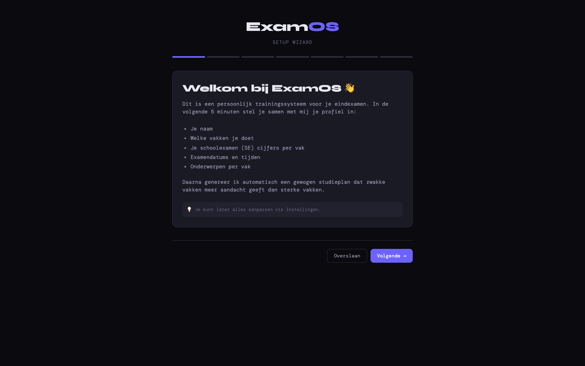
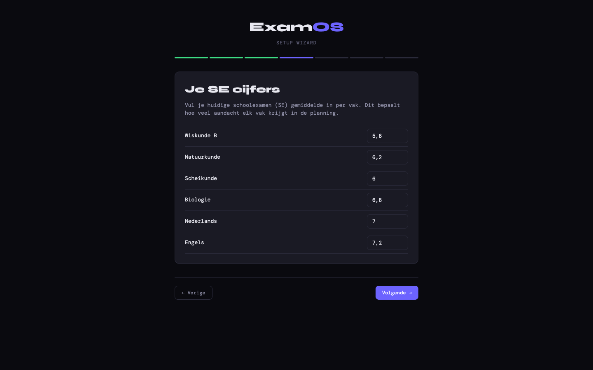
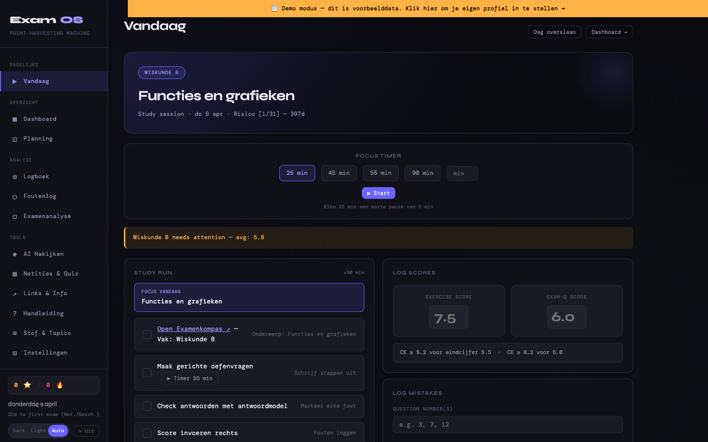
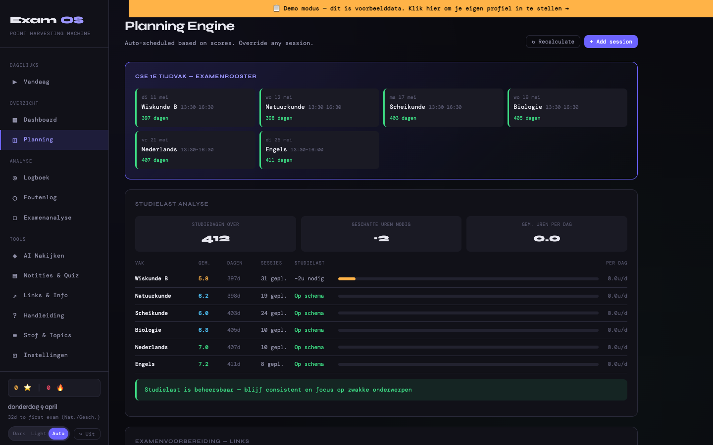
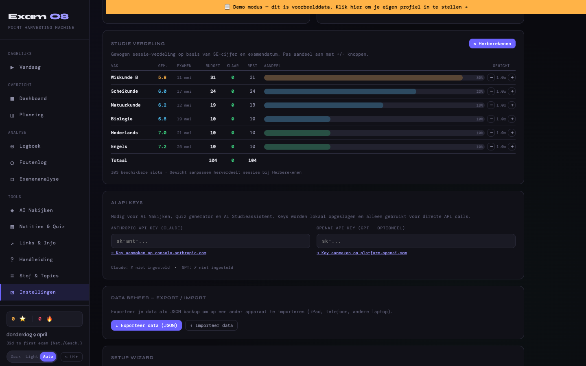

<div align="center">

# ExamOS 2027 — VWO/HAVO Template

**Persoonlijk trainingssysteem voor eindexamen CSE 2027 — gebruik de wizard om jouw profiel te maken**

[](https://examos-2027.vercel.app)
[](LICENSE)
[](https://claude.com/claude-code)

**[📱 Live Demo](https://examos-2027.vercel.app)** · **[🧙 Wizard Walkthrough](#-setup-wizard)** · **[🎯 Features](#features)**



</div>

---

> **Template voor alle 2027 eindexamen studenten.** Ships met demo data en placeholder examen-datums. Bij eerste gebruik verschijnt een 7-stap wizard die de demo data overschrijft met je eigen vakken, SE-cijfers en persoonlijke examen-rooster (vul je officiële 2027 datums in wanneer die bekend zijn).

---

## 🎯 Welke versie heb ik nodig?

| Versie | Doelgroep | Data | Login |
|--------|-----------|------|-------|
| [ExamOS Jussi Edition](https://github.com/ColdDesertLab/ExamOS) | Jussi persoonlijk (VWO 2026) | Zijn echte cijfers + rooster | `Jussi` / `Jones2026!` |
| [ExamOS-2026](https://github.com/ColdDesertLab/ExamOS-2026) | Andere 2026 VWO/HAVO studenten | Demo data + echte mei 2026 datums | `demo` / `demo` |
| **[ExamOS-2027](https://github.com/ColdDesertLab/ExamOS-2027)** ← je bent hier | 2027 VWO/HAVO studenten | Demo data + placeholder datums | `demo` / `demo` |

---

## 🚀 Getting Started

### 1. Probeer de demo

Open **[examos-2027.vercel.app](https://examos-2027.vercel.app)** in je browser.

**Demo login:** `demo` / `demo`

Bij eerste bezoek verschijnt de **setup wizard** automatisch. Je kunt deze overslaan om rond te klikken in demo data, of direct je eigen profiel invullen (5 minuten).

### 2. Self-host — One-liner installer

```bash
curl -fsSL https://raw.githubusercontent.com/ColdDesertLab/ExamOS-2027/master/install.sh | bash
examos-2027
```

Cloned repo naar `~/.examos-2027`, launcher in `~/.local/bin/examos-2027`, start lokale server en opent app. Auto-update per run.

### 3. Fork & deploy naar eigen Vercel

```bash
gh repo fork ColdDesertLab/ExamOS-2027 --clone
cd ExamOS-2027
npx vercel deploy --prod
```

Of clone handmatig:
```bash
git clone https://github.com/ColdDesertLab/ExamOS-2027.git
cd ExamOS-2027
python3 -m http.server 8000
# open http://localhost:8000/ExamOS.html
```

---

## 🧙 Setup Wizard

Bij eerste bezoek (of via **Instellingen → Wizard opnieuw doen**) verschijnt een 7-stap full-screen wizard:

| Stap | Wat | Invoer |
|------|-----|--------|
| 1. **Welkom** | Uitleg van het systeem | — |
| 2. **Persoonlijk** | Je naam (verschijnt in notificaties + dashboard) | Tekst |
| 3. **Vakken** | Selecteer uit 19 VWO/HAVO presets of voeg eigen toe | Checkboxes |
| 4. **SE Cijfers** | Je huidige schoolexamen gemiddelde per vak | Number (1.0-10.0) |
| 5. **Examendatums** | Datum, tijd, duur per vak (check officieel 2027 rooster) | Date + time + duration |
| 6. **Topics** | Hoofdonderwerpen per vak (vooringevuld met defaults) | Textarea |
| 7. **Klaar** | Samenvatting → klik "Plan genereren" | — |

**Bij voltooien:**
- Demo data wordt gewist
- Jouw vakken + SE-cijfers worden opgeslagen
- Een gewogen studieplan wordt automatisch gegenereerd
- `state.wizardCompleted = true` — wizard komt niet terug

**Vakken presets:** Wiskunde A/B/C/D, Natuurkunde, Scheikunde, Biologie, Economie, M&O, Geschiedenis, Aardrijkskunde, Maatschappijleer, Filosofie, Kunst, Nederlands, Engels, Duits, Frans, Spaans, Latijn, Grieks.

---

## 📸 Screenshots

| Wizard: SE cijfers invullen | Vandaag (na wizard) |
|---|---|
|  |  |

| Planning Engine | Studie Verdeling tabel |
|---|---|
|  |  |

---

## 📅 CSE 1e tijdvak 2027

De officiële 2027 examendatums zijn nog niet definitief. Demo gebruikt placeholder datums rond mei 2027 — pas deze aan tijdens de wizard zodra je rooster bekend is.

---

## 📱 PWA Home Screen Setup

### iPad / iPhone
1. Open **examos-2027.vercel.app** in Safari
2. Deel-knop → **"Zet op beginscherm"** → **"Voeg toe"**
3. App verschijnt full-screen op beginscherm

### macOS (Chrome / Edge / Arc)
1. Klik ⋮-menu → **"ExamOS installeren..."**
2. Verschijnt in **Applications** + **Launchpad** → sleep naar Dock

### macOS (Safari)
1. **Bestand** → **"Toevoegen aan Dock..."**

### Android
1. Chrome → ⋮ → **"App installeren"**

---

## ⚙️ Smart Features

### Auto-recalculate bij stale planning
Open je app na een paar dagen niet? Bij de volgende start detecteert ExamOS verlopen sessies en **herbereken automatisch** de planning vanaf vandaag. Werkt naadloos bij vakantie, ziekte of vergeten dagen.

### Gewogen Budget Planner
- **Score deficit**: `max(0, 6.5 - huidig_niveau)` — zwakke vakken krijgen automatisch meer sessies
- **Tijdsdruk**: `√(36 / dagen_tot_examen)` — eerdere examens front-loaded
- **Handmatige override**: 0.2x – 3.0x per vak via Instellingen

### Sterren & Gamification
- **Sterren**: sessie afronden (+1), score ≥7.0 (+1), ≥8.0 (+2), bonus activiteiten (+1)
- **Streak**: consecutive dagen met sessies, milestones op 3d/7d/14d
- **Week bonus**: alle sessies van de week af → +3 sterren
- Zichtbaar in sidebar + dashboard

### Bonus Activiteiten (na dag-klaar)
4 kaarten voor extra sterren:
- **Extra Sessie** voor zwakste vak
- **Fouten Herhaling** interactief
- **Theorie Uitleg** AI samenvatting
- **Flashcard Quiz**

### Examen-bewuste Scheduling
Verschillende dagtypes met eigen slot-aantal en sessieduur: normale dag, zaterdag, zondag, examenweek, dag-vóór-examen, examendag, dag-na-examen. Dubbele examendagen = rust.

---

## 🤖 AI Features — Hoe werkt de API?

De app zelf (planner, timer, foutenlog, sterren, wizard) **werkt zonder API key**. Alleen de AI-features vereisen een key:

| Feature | API nodig |
|---------|-----------|
| Planner, timer, sterren, foutenlog | ❌ Nee |
| AI Grader (examens nakijken) | ✅ Anthropic |
| Quiz Generator | ✅ Anthropic of OpenAI |
| AI Studieassistent (chat) | ✅ Anthropic of OpenAI |

**Belangrijk:** Dit is de **Anthropic API / OpenAI API** (pay-per-token), **niet je Claude.ai of ChatGPT abonnement**. Die abonnementen geven geen API-toegang.

- **Anthropic API key**: [console.anthropic.com/settings/keys](https://console.anthropic.com/settings/keys) — credit kopen vanaf $5
- **OpenAI API key**: [platform.openai.com/api-keys](https://platform.openai.com/api-keys) — prepaid credit

Keys worden **lokaal opgeslagen** in je browser en direct naar de API gestuurd. Typisch gebruik: één examen nakijken ≈ $0.05-0.15 Claude / $0.02-0.08 GPT-4o.

---

## ☁️ Cloud Sync (optioneel)

Deze template heeft cloud sync **uitgeschakeld** by default (alleen localStorage). Om cross-device sync te activeren:

1. Maak een gratis [Supabase](https://supabase.com) project
2. SQL editor → run:
   ```sql
   create table examos_state (
     id text primary key,
     state jsonb,
     updated_at timestamptz default now(),
     version int default 0
   );
   insert into examos_state (id) values ('default');
   alter table examos_state enable row level security;
   create policy "open" on examos_state for all using (true);
   ```
3. In `ExamOS.html` (regel ~2180):
   ```javascript
   const SUPABASE_URL = 'https://your-project.supabase.co';
   const SUPABASE_KEY = 'your-anon-key';
   ```
4. Deploy + log in op meerdere apparaten → sync werkt automatisch

---

## Features

- **Setup wizard** — 7-stap first-run configuratie
- **Auto-recalculate** bij stale planning
- **Gewogen budget planner** met handmatige weight overrides
- **Pomodoro timer** (25/45/55/90 min) met fullscreen break overlay
- **AI Grader** — upload examens → scoring met N-term → auto foutenlog (Claude/GPT)
- **Quiz Generator** — AI meerkeuzevragen per vak
- **AI Studieassistent** — chat met 4 modes
- **Flashcards** — automatisch uit foutenlog
- **Formulebladen** voor Wiskunde B, Natuurkunde, Scheikunde, Biologie
- **Oude examens** — directe links naar examenblad.nl per vak per jaar
- **Foutenlog** met F1-F8 codes
- **Sterren & streaks** gamification
- **Dag-klaar celebration** met confetti + bonus kaarten
- **Dashboard** met subject cards + studielast analyse
- **Studie verdeling tabel** in Instellingen
- **PWA** — installeerbaar op iPad, iPhone, macOS, Android
- **Dark / Light / Auto theme**
- **Cross-device sync** via Supabase (optioneel)

## Tech Stack

| Laag | Technologie |
|------|-------------|
| Frontend | Single HTML (~6700 regels), vanilla JS, geen frameworks |
| Styling | CSS custom properties, responsive |
| Data | localStorage + optionele Supabase sync |
| AI | Anthropic Claude + OpenAI (optioneel) |
| Hosting | Vercel / Netlify / GitHub Pages / self-host |
| PWA | manifest.json + canvas-generated icons |

## License

MIT — fork, customize, deploy. Geen attributie vereist.

---

<div align="center">

Part of the [ExamOS](https://github.com/ColdDesertLab/ExamOS) family · Built with [Claude Code](https://claude.com/claude-code)

</div>
